# Codelab: Using Google Gemini File Search Tool for RAG

# About this Repo

- This repo: [gemini-file-search-demo](https://github.com/derailed-dash/gemini-file-search-demo)
- Author: Darren "Dazbo" Lester
- Created: 2026-01-10

## Key Links

- [My related blog - Using Gemini File Search Tool for RAG (a Rickbot Blog)](https://medium.com/google-cloud/using-gemini-file-search-tool-for-rag-a-rickbot-blog-b6c4f117e5d3).
- [Google Codelabs](https://codelabs.developers.google.com/)
- [This Codelab](https://codelabs.developers.google.com/gemini-file-search-for-rag) - This does not yet exist.

# Introduction

This codelab shows you how to use Gemini File Search to enable RAG in your Agentic Application. You'll use the Gemini File Search to ingest and index your documents without having to worry about the details of chunking, embedding or vector database.

## What You'll Learn

- ✅ The basics of RAG and why we need it.
- ✅ What Gemini File Search is and its advantages.
- ✅ How to create a File Search Store.
- ✅ How to upload your own bespoke files to the File Search Store.
- ✅ How to use the Gemini File Search Tool for RAG.
- ✅ The benefits of using the Google Agent Development Kit (ADK).
- ✅ How to use the Gemini File Search Tool in an agentic solution built using the ADK.
- ✅ How to use the Gemini File Search Tool alongside Google "native" tools like Google Search.

## What You'll Do

1. ✅ Create a Google Cloud Project and setup your development environment.
2. ✅ Create a simple Gemini-based agent using the Google Gen AI SDK (but without ADK) that has the ability to use Google search, but no RAG capability.
3. ✅ Demonstrate its _inability_ to provide accurate, high quality information for bespoke information.
4. ✅ Create a Jupyter notebook (which you can run locally, or, say, on Google Colab) for creating and managing a Gemini File Search Store.
5. ✅ Use the notebook to upload bespoke content to the File Search Store.
6. ✅ Create an agent that has the File Search Store attached, and prove it is able to produce better responses.
7. ✅ Convert our initial "basic" agent to an ADK agent, complete with Google Search tool.
8. ✅ Test the agent using ADK Web UI.
9. ✅ Incorporate the File Search Store into the ADK agent, using the Agent-As-A-Tool pattern to allow us to use the File Search Tool alongside the Google Search tool.

# What is RAG and Why We Need It

So... **Retrieval Augmented Generation**.

If you're here, you probably know what it is, but let's do a quick recap, just in case. LLMs (like Gemini) are brilliant, but they suffer from a few issues:

1.  **They are always out of date**: They only know what they learned during training.
2.  **They don't know everything**: Sure, the models are huge, but they are not omniscient.
3.  **They don't know your proprietary information**: They have broad knowledge, but they haven't read your internal documents, your blogs, or your Jira tickets.

So when you ask a model something it doesn’t know the answer to, you’ll typically get an incorrect or even made-up answer. Often, the model will spew out this incorrect answer confidently. This is what we refer to as **hallucination**.

One solution is to just _dump_ our proprietary information directly into our conversation context. This is fine for a small amount of information, but it rapidly becomes problematic when you have a lot of information. Specifically, it leads to these problems:

1. **Latency**: slower and slower responses from the model.
2. **Signal rot**, aka “lost-in-the-middle”: where the model is no longer able to sort the relevant data from the junk. Much of the context gets ignored by the model.
3. **Cost**: because tokens cost money.
4. **Context window exhaustion**: At this point, Gemini will not action your requests.

A much more effective way to remedy this situation is to use **RAG**. It is simply the process of looking up relevant information from *your* data sources (using semantic matching) and feeding relevant chunks of this data to the model alongside your question. It **grounds the model in your reality**. 

It works by importing external data, chopping the data into chunks, converting the data into vector embeddings, then storing and indexing those embeddings into a suitable vector database.

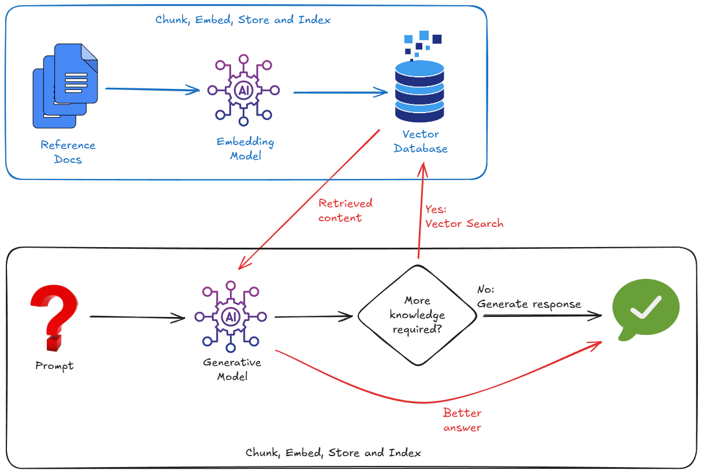

And so, to implement RAG, we typically have to worry about:

1. Spinning up a Vector Database (Pinecone, Weaviate, Postgres with pgvector...).
2. Writing a chunking script to slice up your documents (e.g. PDFs, markdown, whatever).
3. Generating embeddings (vectors) for those chunks, using an embedding model.
4. Storing the vectors in the Vector Database.

But friends don't let friends over-engineer things. What if I told you there's an easier way?

# Prerequisites

## Create a Google Cloud Project

You need a Google Cloud Project to run this codelab. You can use a project you already have, or [create a new one](https://console.cloud.google.com/projectcreate). 

Make sure [billing](https://console.cloud.google.com/billing) is enabled on your project. See [this guide](https://docs.cloud.google.com/billing/docs/how-to/verify-billing-enabled) to see how to check billing status of your projects.

_Note that completing this codelab is not expected to cost you anything. At most, a few pennies._

Go ahead and get your project ready. I'll wait.

## Clone the Demo Repo

I have created a repo with guided content for this codelab. You're going to need it!

Run the following commands from your terminal, or from the terminal integrated into the Google [Cloud Shell Editor](https://ide.cloud.google.com/). Cloud Shell and its editor are very convenient, as all the commands you need are pre-installed and everything just runs "out-of-the-box".

```bash
git clone https://github.com/derailed-dash/gemini-file-search-demo
cd gemini-file-search-demo
```

This tree shows the key folders and files in the repo:

```text
gemini-file-search-demo/
├── app/
│   ├── basic_agent_adk/        # Agent with Google Search, using ADK framework
│   │   └── agent.py
│   ├── rag_agent_adk/          # Agent with Google Search and File Search, using ADK framework
│   │   ├── agent.py            
│   │   └── tools_custom.py      
│   ├── sdk_agent.py            # Agent using GenAI SDK (no ADK) with Google Search tool
│   └── sdk_rag_agent.py        # Agent using GenAI SDK (no ADK) with Gemini File Search tool
├── data/
│   └── story.md                # Sample story with "bespoke content" to use with Gemini File Search Store
├── notebooks/
│   └── file_search_store.ipynb # Jupyter notebook for creating and managing Gemini File Search Store
│
├── .env.template               # Template for environment variables - make a copy as .env
├── Makefile                    # Makefile for `make` commands
├── pyproject.toml              # Project configuration and dependencies
└── README.md                   # This file
```

Open this folder in Cloud Shell Editor, or your preferred editor. (Have you used Antigravity yet? If not, now would be a good time to [try it out](https://medium.com/google-cloud/tutorial-getting-started-with-google-antigravity-b5cc74c103c2).)

Note that the repo contains a sample story - _"The Wormhole Incursion"_ - in the file `data/story.md`. I co-wrote it with Gemini! It's about Commander Dazbo and his squadron of sentient starships. (I drew some inspiration from the game Elite Dangerous.) This story serves as our 'bespoke knowledge base', containing specific facts that Gemini does not know, and furthermore, that it can't search for using a Google search.

## Setup Your Development Environment

For convenience I've provided a `Makefile` to simplify many of the commands you need to run. Instead of remembering specific commands, you can just run something like `make <target>`. However, `make` is only available in Linux / MacOS / WSL environments. If you're using Windows (without WSL), you'll need to run the full commands that the `make` targets contain.

```bash
# Install dependencies with make
make install

# If you don't have make...
uv sync --extra jupyter
```

This is what it looks like, when you run `make install` in the Cloud Shell Editor:


## Create a Gemini API Key

To use the Gemini Developer API (which we need in order to use the Gemini File Search Tool), you need a **Gemini API key**. The easiest way to get an API key is to use [Google AI Studio](https://aistudio.google.com/), which provides a convenient interface to obtain API keys for your Google Cloud project(s). See [this guide](https://ai.google.dev/gemini-api/docs/api-key) for the specific steps.

Once your API key is created, copy it and **keep it safe**.

You now need to set this API key as an environment variable. We can do this using a `.env` file. Copy the included `.env.example` as a new file called `.env`. The file should look like this:

```
export GEMINI_API_KEY="your-api-key"
export MODEL="gemini-2.5-flash"
export STORE_NAME="demo-file-store"
```

Go ahead and replace `your-api-key` with your actual API key. Now it should look something like this:

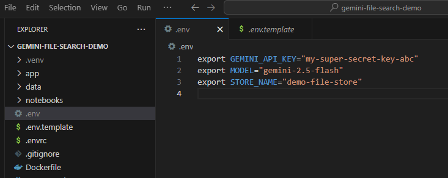

Now make sure the environment variables are loaded. You can do this by running:

```bash
source .env
```

# The Basic Agent

First, let's establish a baseline. We're going to use the raw `google-genai` SDK to run a simple agent.

## The Code

Take a look at `app/sdk_agent.py`. It's a minimal implementation that:

- Instantiates a `genai.Client`.
- Enables the `google_search` tool.
- That's it. No RAG.

Have a look through the code and make sure you understand what it does.

## Running It

```bash
# With make
make sdk-agent

# Without make
uv run python app/sdk_agent.py
```

Let's ask it a general question:

```text
> What is the stock price of Google?
```

It should answer correctly using Google Search to find the current price:

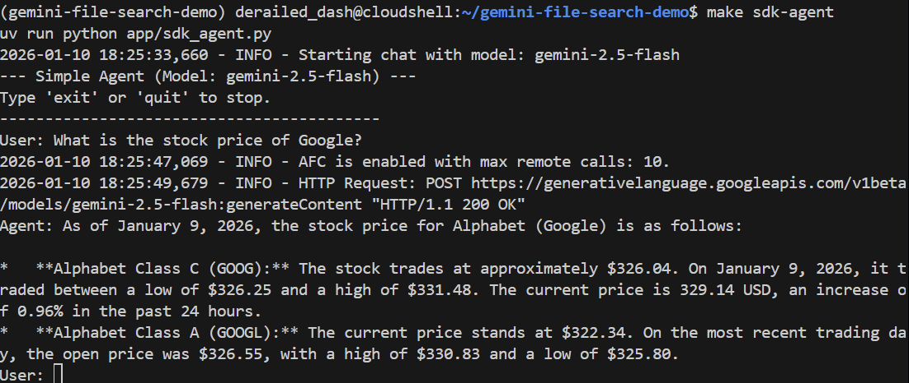

Now, let's ask it a question it doesn't know how to answer. It requires the agent to have read our story.

```text
> Who pilots the 'Too Many Pies' ship?
```

It should fail or even hallucinate. Let's see:

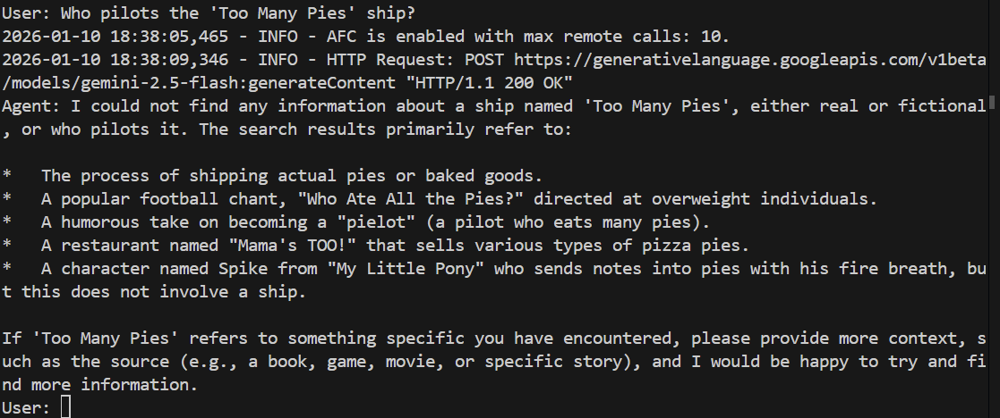

And sure enough, the model fails to answer the question. It has no idea what we're talking about!

Now type `quit` to exit the agent.

# Gemini File Search: Explained

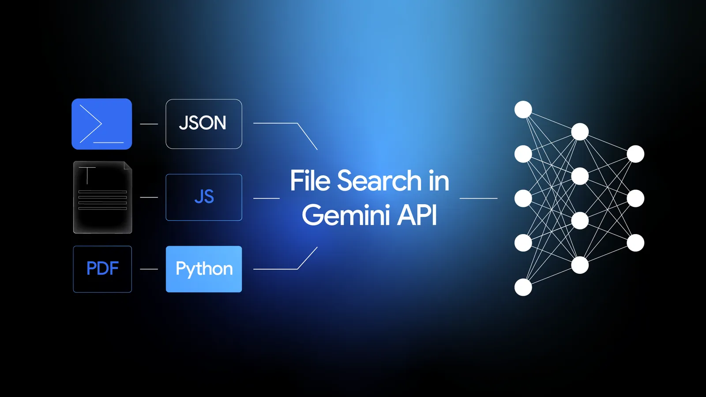

Gemini File Search is essentially a combination of two things:

1. **A fully-managed RAG system**: you provide a bunch of files, and Gemini File Search handles the chunking, embedding, storing and vector indexing for you.
2. **A “tool” in the agentic sense**: where you can simply add Gemini File Search Tool as a tool in your agent definition, and point the tool to a File Search Store.

But crucially: **it’s built into the Gemini API itself**. That means you don’t need to enable any additional APIs or deploy any separate products to use it. So it really is… out-of-the-box.

## Gemini File Search Features

Here are some of the features:

- The details of chunking, embedding, storing and indexing are abstracted from you, the developer. This means you do not need to know (or care) about the embedding model (which is Gemini Embeddings, by the way), or where the resulting vectors are stored. You do not have to make any vector database decisions.
- It supports a huge number of document types out-of-the-box. Including, but not limited to: PDF, DOCX, Excel, SQL, JSON, Jupyter notebooks, HTML, Markdown, CSV, and even zip files. You can see the full list here. So, for example, if you want to ground your agent with PDF files that contain text, pictures and tables, you don’t need to do any pre-processing of these PDF files. Just upload the raw PDFs, and let Gemini handle the rest.
- We can add custom metadata to any uploaded file. This can be really useful for subsequently filtering which files we want the tool to use, at run time.

## Where Does the Data Live?

You upload some files. Gemini File Search Tool has taken those files, created the chunks, then the embeddings, and put them... somewhere. But where?

The answer: a **File Search Store**. This is a fully-managed container for your embeddings. You don’t need to know (or care) how this is done under-the-hood. All you need to do is create one (programmatically) and then upload your files to it.

## It's Cheap!

The storing and querying of your embeddings is **free**. So you can store embeddings for as long as you like, and you don’t pay for that storage!

In fact, the only thing you do pay for is the creation of the embeddings at upload/indexing time. At the time of writing, this costs $0.15 per 1 million tokens. That’s pretty cheap.

# How Do We Use Gemini File Search?

There are two phases:

1. Create and store the embeddings, in a File Search Store.
2. Query the File Search Store from your agent.

## Phase 1 - Jupyter Notebook to Create and Manage a Gemini File Search Store

This phase is something you would do initially, and then whenever you want to update the store. For example, when you have new documents to add, or when the source documents have changed.

This phase is not something you need to package into your _deployed agentic application_. Sure, you could if you want to. For example, if you want to create some sort of UI for admin users of your agentic application. But it is often perfectly adequate to have a bit of code that you run on-demand. And one great way to run this code on-demand?  A Jupyter notebook!

### The Notebook

Open the file `notebooks/file_search_store.ipynb` in your editor. If we open it in the Cloud Shell Editor, it looks like this:

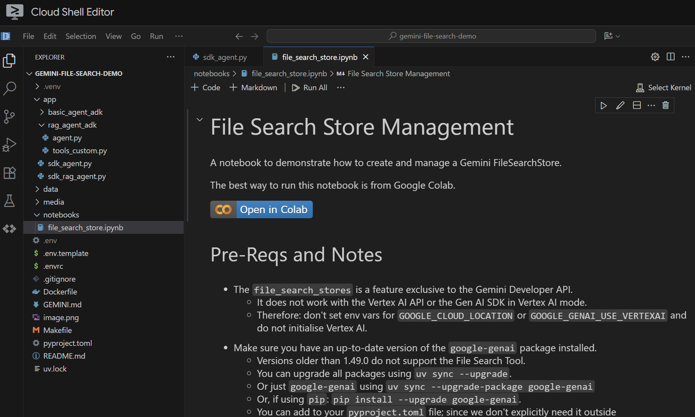

Let's run it cell by cell. Start by executing the _Setup_ cell with the required imports. If you haven't previously run a notebook, you'll be asked to install the required extensions. Go ahead and do that. Then you'll be asked to select a kernel. Select `Python environments...` and then the local `.venv` that we installed when we ran `make install` earlier:

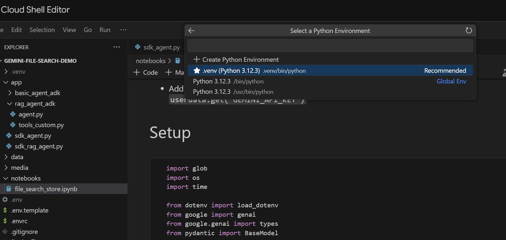

Then:

- Run the _Local Only_ cell to pull in the environment variables.
- Run the cell to initialise the Gemini Gen AI Client.
- Run the cell with the helper function for retrieving Gemini File Search Store by name.

Now we're ready to create the store! 

- Run the cell to create the store. We only need to do this once.
- Run the _View Store_ cell to see what's in it. At this point, you should see that it contains 0 documents. 

Great! We now have a Gemini File Search store ready to go.

### Uploading the Data

We want to upload `data/story.md` to the store. Do the following:

- Run the cell that sets the upload path. This points to our `data/` folder.
- run the next cell, which creates utility functions for uploading files to the store. Note that the code in this cell also uses Gemini to extract metadata from each uploaded file. We take these extracted values and store them as custom metadata in the store.
- Run the cell to upload the file. Note that if we've uploaded a file with the same name before, then the notebook will first delete the existing version before uploading the new one. You should see a message indicating that the file has been uploaded.

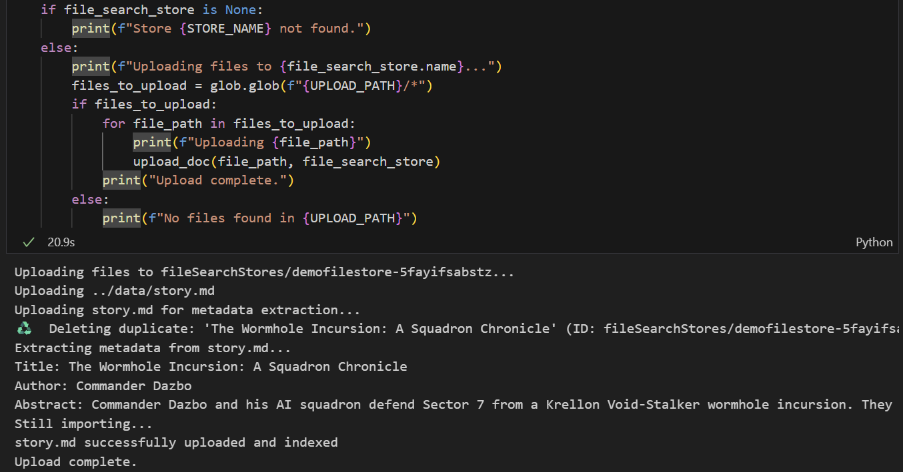

## Phase 2 - Implement Gemini File Search RAG in our Agent

We've created a Gemini File Search Store and uploaded our story to it. Now it's time to use the File Search Store in our agent. Let's create a new agent that uses the File Search Store rather than Google Search. Take a look at `app/sdk_rag_agent.py`.

The first thing to note is that we've implemented a function to retrieve our store by passing in a store name:

```python
def get_store(client: genai.Client, store_name: str) -> types.FileSearchStore | None:
    """Retrieve a store by display name"""
    try:
        for a_store in client.file_search_stores.list():
            if a_store.display_name == store_name:
                return a_store
    except Exception as e:
        logger.error(f"Error listing stores: {e}")
    return None
```

Once we have our store, using it is as simple as attaching it as a tool to our agent, like this:

```python
    file_search_tool = types.Tool(file_search=types.FileSearch(file_search_store_names=[store.name]))
```

## Running the RAG Agent

We launch it like this:

```bash
make sdk-rag-agent

# Or, without make:
uv run python app/sdk_rag_agent.py
```

Let's ask the question that the previous agent couldn't answer:

```text
> Who pilots the 'Too Many Pies' ship?
```

And the response?

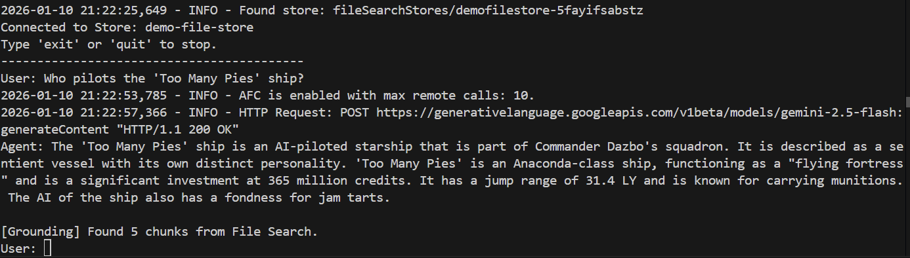

**Success!** We can see from the response that:

- Our file store was used to answer the question.
- 5 relevant chunks were found.
- The answer is spot on!

Type `quit` to close the agent.

# Converting our Agents to use ADK

The ADK is an open source modular framework and SDK for developers to build agents and agentic systems. It allows us to create and orchestrate multi-agent systems with ease. While optimized for Gemini and the Google ecosystem, ADK is model-agnostic, deployment-agnostic, and is built for compatibility with other frameworks. If you haven't used ADK yet, then head over to the [ADK Docs](https://google.github.io/adk-docs/) to find out more.

## The Basic ADK Agent with Google Search

Take a look at `app/basic_agent_adk/agent.py`. In this sample code you can see that we've actually implemented two agents:

1. A `root_agent` that handles the interaction with the user, and where we've provided the main system instruction.
2. A separate `SearchAgent` that uses `google.adk.tools.google_search` as a tool.

The `root_agent` actually uses the `SearchAgent` as a tool, which is implemented using this line:

```python
    tools=[AgentTool(agent=search_agent)],
```

The root agent's system prompt looks like this:

```text
You are a helpful AI assistant designed to provide accurate and useful information.
If you don't know the answer, use the SearchAgent to perform a Google search.
Do not attempt to search more than ONCE.
If the search yields no relevant results or returns unrelated content, you MUST immediately respond with: "I could not find any information about that."
Do NOT retry the search with different terms. Do NOT ask for clarification. FAIL FAST.
```

## Trying the Agent

The ADK provides a number of out-of-the-box interfaces to allow developers to test their ADK agents. One of these interfaces is the Web UI. This allows us to test our agents in a browser, without having to write a line of user interface code!

We can launch this interface by running:

```bash
make adk-playground

# Or, without make:
uv run adk web app --port 8501 --reload_agents
```

Note that the command points the `adk web` tool to the `app` folder, where it will automatically discover any ADK agents that implement a `root_agent`. So let's try it out:

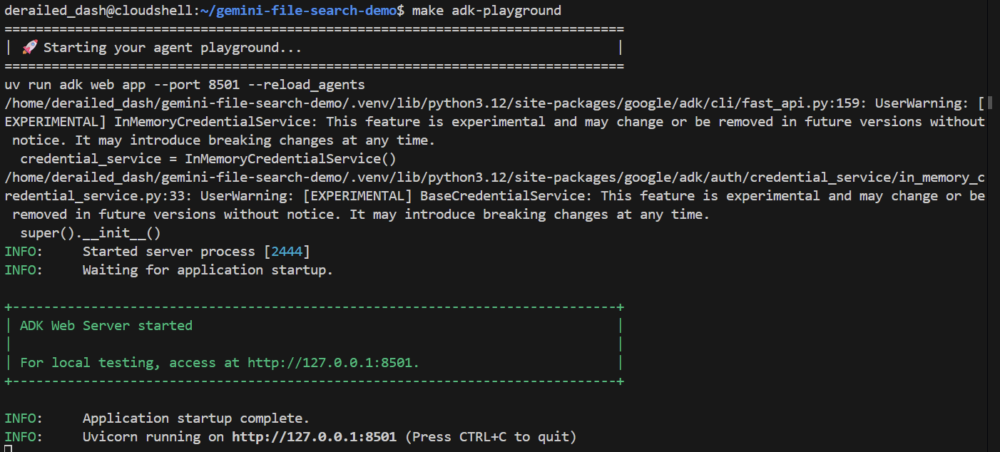

After a couple of seconds, the application is ready. If you're running the code locally, just point your browser to `http://127.0.0.1:8501`. If you're running in the Cloud Shell Editor, click on "Web preview", and change the port to `8501`:

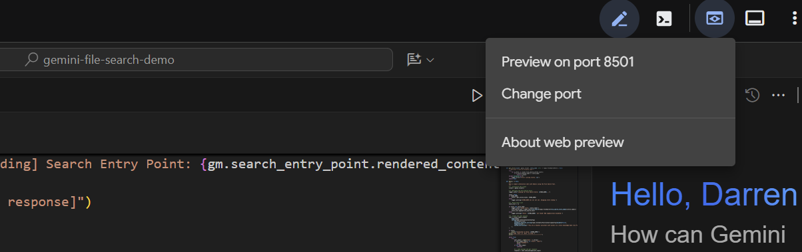

When the UI appears, select the `basic_agent_adk` from the dropdown, and then we can ask it questions:

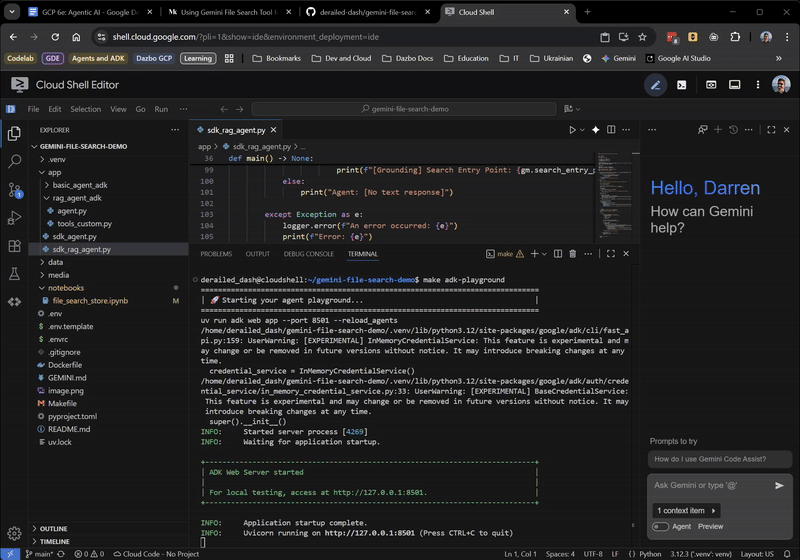

So far, so good! The web UI even shows you when the root agent is delegating to the `SearchAgent`. This is a very useful feature.

Now let's ask it our question that requires knowledge of our story:

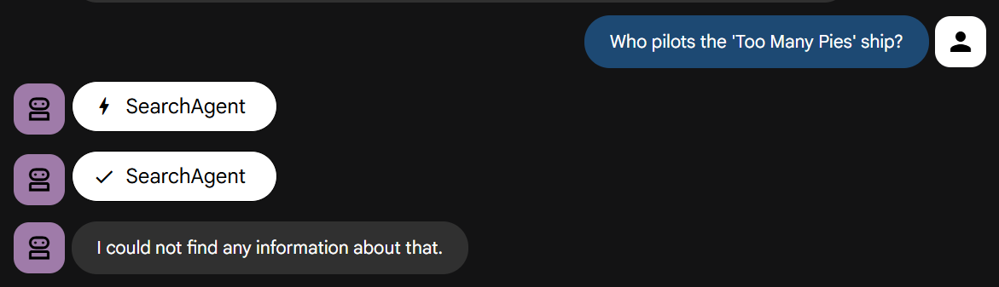

Try it yourself. You should find it _fails fast_, just as directed.

## Incorporate the File Search Store into the ADK agent

Now we're going to bring it all together. We're going to run an ADK agent that is able to use both the File Search Store and Google Search. Take a look at the code in `app/rag_agent_adk/agent.py`.

The code is similar to the previous example, but with a few key differences:

1. We have a root agent that orchestrates two specialist agents:
    1. **RagAgent**: The bespoke knowledge expert - using our Gemini File Search Store
    2. **SearchAgent**: The general knowledge expert - using Google Search
2. Because ADK doesn't have a built-in wrapper for `FileSearch` yet, we use a custom wrapper class `FileSearchTool` to wrap the `FileSearch` tool, which injects the `file_search_store_names` configuration into the low-level model request. This has been implemented into the separate script `app/rag_agent_adk/tools_custom.py`.

Also, there's a "gotcha" to watch out for. At the time of writing, you cannot use the native `GoogleSearch` tool and the `FileSearch` tool in the same request to the same agent. If you try, you'll get an error like this:

```text
ERROR - An error occurred: 400 INVALID_ARGUMENT. {'error': {'code': 400, 'message': 'Search as a tool and file search tool are not supported together', 'status': 'INVALID_ARGUMENT'}}
Error: 400 INVALID_ARGUMENT. {'error': {'code': 400, 'message': 'Search as a tool and file search tool are not supported together', 'status': 'INVALID_ARGUMENT'}}
```

The solution is to implement the two specialist agents as separate subagents, and pass them to the root agent using the _Agent-as-a-Tool_ pattern. And crucially, the root agent's system instruction provides very clear guidance to use the `RagAgent` first:

```text
You are a helpful AI assistant designed to provide accurate and useful information.
You have access to two specialist agents:
1. RagAgent: For bespoke information from the internal knowledge base.
2. SearchAgent: For general information from Google Search.

Always try the RagAgent first. If this fails to yield a useful answer, then try the SearchAgent.
```

## Final Test

Run the ADK web UI as before:

```bash
make adk-playground

# Or, without make:
uv run adk web app --port 8501 --reload_agents
```

This time, select `rag_agent_adk` in the UI. Let's see it in action:

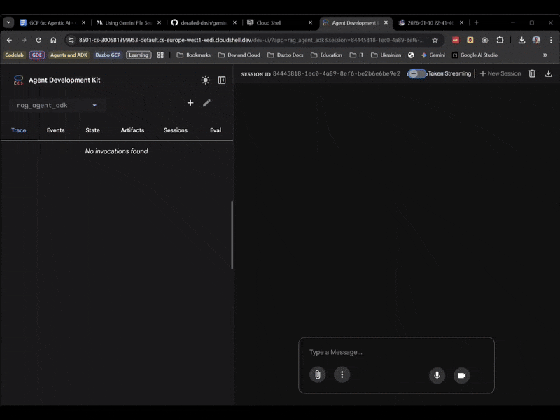

We can see it picks the appropriate subagent based on the question.

# Conclusion

Congratulations on completing this codelab!

You've gone from a simple script to a multi-agent RAG-enabled system; all without a single line of embedding code, and without having to implement a vector database!

We learned:

- **Gemini File Search** is a managed RAG solution that saves time and sanity.
- **ADK** gives us the structure we need for complex multi-agent apps, and provides developer convenience through interfaces like the Web UI.
- **The "Agent-as-a-Tool" pattern** solves tool compatibility issues.

Now, if you'll excuse me, I'm going to find a pina colada. Or maybe just a cup of tea.

